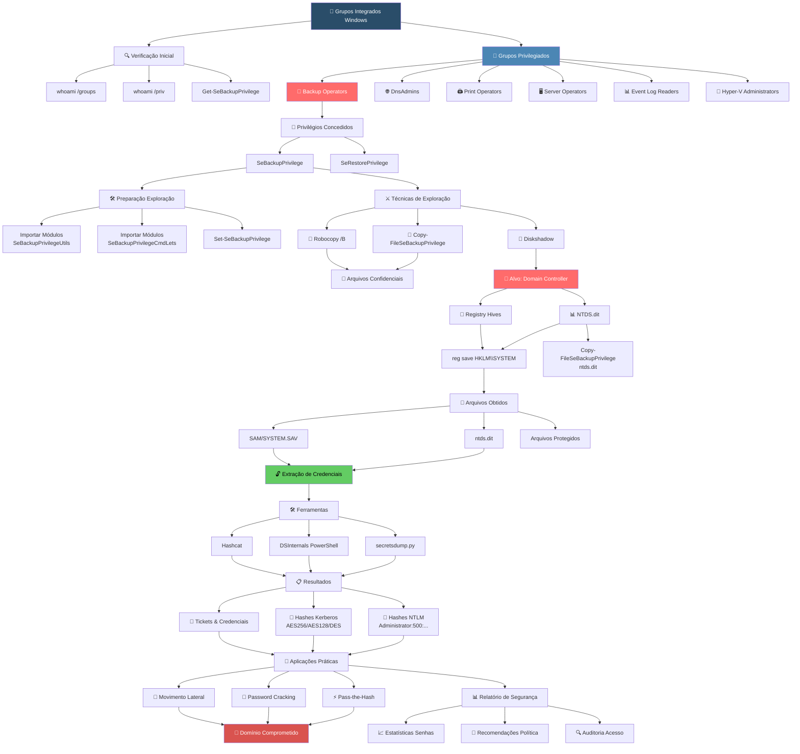

# Windows Built-in Groups

```mermaid
flowchart TD
    A[🏢 Grupos Integrados Windows] --> B[🔍 Verificação Inicial]
    A --> C[🎯 Grupos Privilegiados]
    
    B --> D[whoami /groups]
    B --> E[whoami /priv]
    B --> F[Get-SeBackupPrivilege]
    
    C --> G[👥 Backup Operators]
    C --> H[🌐 DnsAdmins]
    C --> I[🖨️ Print Operators]
    C --> J[🖥️ Server Operators]
    C --> K[📊 Event Log Readers]
    C --> L[🔮 Hyper-V Administrators]
    
    G --> M[💂 Privilégios Concedidos]
    M --> N[SeBackupPrivilege]
    M --> O[SeRestorePrivilege]
    
    N --> P[🛠️ Preparação Exploração]
    P --> Q[Importar Módulos<br>SeBackupPrivilegeUtils]
    P --> R[Importar Módulos<br>SeBackupPrivilegeCmdLets]
    P --> S[Set-SeBackupPrivilege]
    
    N --> T[⚔️ Técnicas de Exploração]
    T --> U[📁 Copy-FileSeBackupPrivilege]
    T --> V[🔄 Robocopy /B]
    T --> W[👻 Diskshadow]
    
    U --> X[📄 Arquivos Confidenciais]
    V --> X
    W --> Y[🎯 Alvo: Domain Controller]
    
    Y --> Z[📊 NTDS.dit]
    Y --> AA[🔐 Registry Hives]
    
    Z --> BB[reg save HKLM\\SYSTEM]
    AA --> BB
    Z --> CC[Copy-FileSeBackupPrivilege<br>ntds.dit]
    
    BB --> DD[💾 Arquivos Obtidos]
    DD --> EE[ntds.dit]
    DD --> FF[SAM/SYSTEM.SAV]
    DD --> GG[Arquivos Protegidos]
    
    EE --> HH[🔓 Extração de Credenciais]
    FF --> HH
    
    HH --> II[🛠️ Ferramentas]
    II --> JJ[secretsdump.py]
    II --> KK[DSInternals PowerShell]
    II --> LL[Hashcat]
    
    JJ --> MM[📋 Resultados]
    KK --> MM
    LL --> MM
    
    MM --> NN[🔑 Hashes NTLM<br>Administrator:500:...]
    MM --> OO[🔑 Hashes Kerberos<br>AES256/AES128/DES]
    MM --> PP[🎫 Tickets & Credenciais]
    
    NN --> QQ[🎯 Aplicações Práticas]
    OO --> QQ
    PP --> QQ
    
    QQ --> RR[⚡ Pass-the-Hash]
    QQ --> SS[🔨 Password Cracking]
    QQ --> TT[🔄 Movimento Lateral]
    QQ --> UU[📊 Relatório de Segurança]
    
    UU --> VV[📈 Estatísticas Senhas]
    UU --> WW[🎯 Recomendações Política]
    UU --> XX[🔍 Auditoria Acesso]
    
    RR --> YY[🎯 Domínio Comprometido]
    SS --> YY
    TT --> YY
    
    style A fill:#2a4d69,color:white
    style C fill:#4b86b4,color:white
    style G fill:#ff6b6b,color:white
    style Y fill:#ff6b6b,color:white
    style HH fill:#63cc63,color:black
    style YY fill:#d9534f,color:white
```
