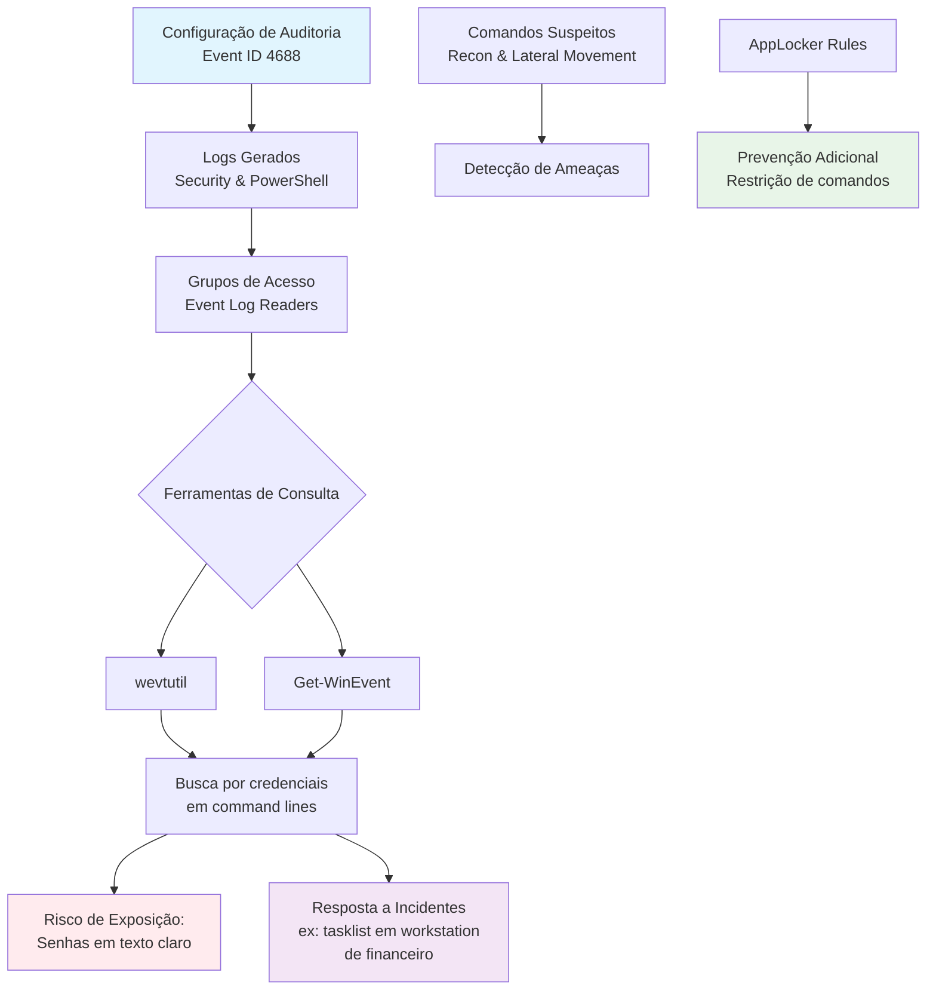

# Event Log Readers

```mermaid

flowchart TD
    A[Configuração de Auditoria<br>Event ID 4688] --> B[Logs Gerados<br>Security & PowerShell]
    
    B --> C[Grupos de Acesso<br>Event Log Readers]
    
    C --> D{Ferramentas de Consulta}
    D --> E[wevtutil]
    D --> F[Get-WinEvent]
    
    E --> G[Busca por credenciais<br>em command lines]
    F --> G
    
    G --> H[Risco de Exposição:<br>Senhas em texto claro]
    
    I[Comandos Suspeitos<br>Recon & Lateral Movement] --> J[Detecção de Ameaças]
    
    G --> K[Resposta a Incidentes<br>ex: tasklist em workstation<br>de financeiro]
    
    L[AppLocker Rules] --> M[Prevenção Adicional<br>Restrição de comandos]
    
    style A fill:#e1f5fe
    style H fill:#ffebee
    style K fill:#f3e5f5
    style M fill:#e8f5e8
```
