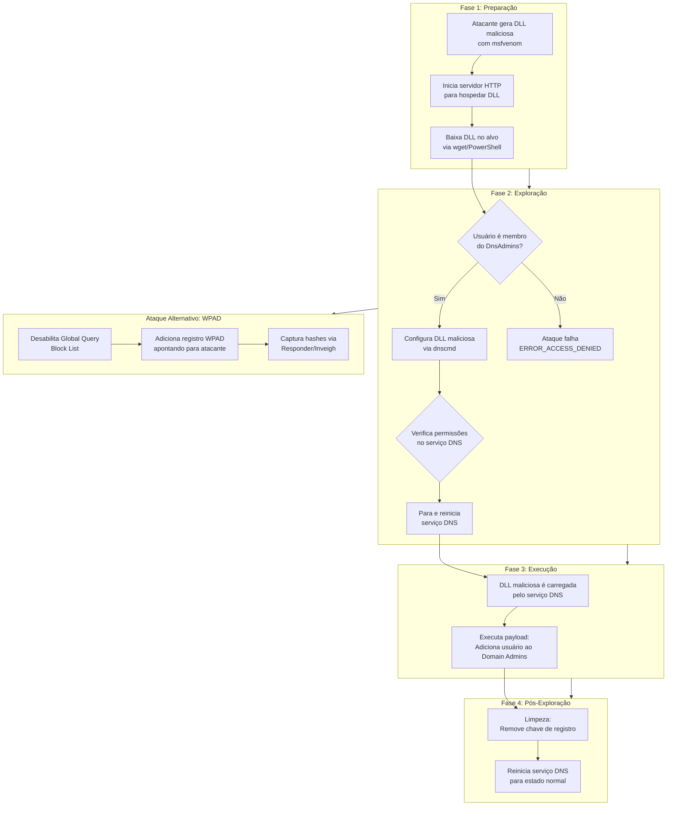

# DnsAdmins

```mermaid
flowchart TD
    subgraph A1 [Fase 1: Preparação]
        A[Atacante gera DLL maliciosa<br>com msfvenom] --> B[Inicia servidor HTTP<br>para hospedar DLL]
        B --> C[Baixa DLL no alvo<br>via wget/PowerShell]
    end

    subgraph A2 [Fase 2: Exploração]
        C --> D{Usuário é membro<br>do DnsAdmins?}
        D -- Sim --> E[Configura DLL maliciosa<br>via dnscmd]
        D -- Não --> F[Ataque falha<br>ERROR_ACCESS_DENIED]
        
        E --> G{Verifica permissões<br>no serviço DNS}
        G --> H[Para e reinicia<br>serviço DNS]
    end

    subgraph A3 [Fase 3: Execução]
        H --> I[DLL maliciosa é carregada<br>pelo serviço DNS]
        I --> J[Executa payload:<br>Adiciona usuário ao Domain Admins]
    end

    subgraph A4 [Fase 4: Pós-Exploração]
        J --> K[Limpeza:<br>Remove chave de registro]
        K --> L[Reinicia serviço DNS<br>para estado normal]
    end

    subgraph A5 [Ataque Alternativo: WPAD]
        M[Desabilita Global Query<br>Block List] --> N[Adiciona registro WPAD<br>apontando para atacante]
        N --> O[Captura hashes via<br>Responder/Inveigh]
    end

    A1 --> A2 --> A3 --> A4
    A2 --> A5
```
