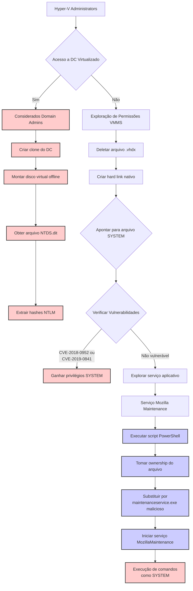

# Hyper-V Administrators

```mermaid
flowchart TD
    A[Hyper-V Administrators] --> B{Acesso a DC Virtualizado}
    B -->|Sim| C[Considerados Domain Admins]
    B -->|Não| D[Exploração de Permissões VMMS]
    
    C --> E[Criar clone do DC]
    E --> F[Montar disco virtual offline]
    F --> G[Obter arquivo NTDS.dit]
    G --> H[Extrair hashes NTLM]
    
    D --> I[Deletar arquivo .vhdx]
    I --> J[Criar hard link nativo]
    J --> K{Apontar para arquivo SYSTEM}
    
    K --> L{Verificar Vulnerabilidades}
    L -->|CVE-2018-0952 ou<br>CVE-2019-0841| M[Ganhar privilégios SYSTEM]
    L -->|Não vulnerável| N[Explorar serviço aplicativo]
    
    N --> O[Serviço Mozilla Maintenance]
    O --> P[Executar script PowerShell]
    P --> Q[Tomar ownership do arquivo]
    
    Q --> R[Substituir por<br>maintenanceservice.exe malicioso]
    R --> S[Iniciar serviço MozillaMaintenance]
    S --> T[Execução de comandos<br>como SYSTEM]
    
    %% Styling
    classDef red fill:#ffcccc,stroke:#333,stroke-width:2px
    classDef green fill:#ccffcc,stroke:#333,stroke-width:2px
    classDef blue fill:#ccccff,stroke:#333,stroke-width:2px
    
    class C,E,F,G,H red
    class M,T red
    class P,Q,R,S blue
```
