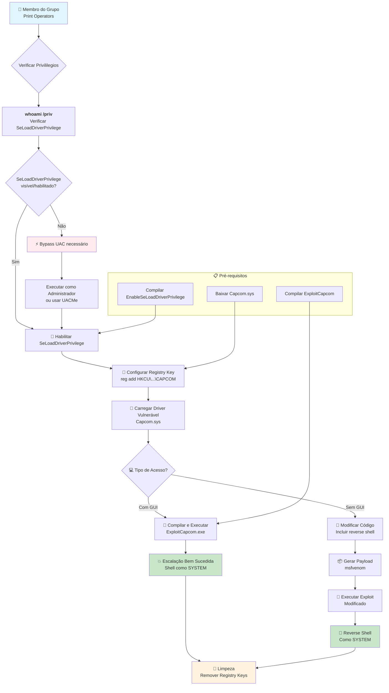

# Print Operators

```mermaid
flowchart TD
    A[🚻 Membro do Grupo<br>Print Operators] --> B{Verificar Privililegios}
    
    B --> C[<b>whoami /priv</b><br>Verificar SeLoadDriverPrivilege]
    
    C --> D{SeLoadDriverPrivilege<br>visível/habilitado?}
    
    D -- Não --> E[⚡ Bypass UAC necessário]
    E --> F[Executar como Administrador<br>ou usar UACMe]
    
    D -- Sim --> G[🔧 Habilitar SeLoadDriverPrivilege]
    
    F --> G
    
    G --> H[📝 Configurar Registry Key<br>reg add HKCU\...\CAPCOM]
    
    H --> I[🚀 Carregar Driver Vulnerável<br>Capcom.sys]
    
    I --> J{💻 Tipo de Acesso?}
    
    J -- Com GUI --> K[🎯 Compilar e Executar<br>ExploitCapcom.exe]
    
    J -- Sem GUI --> L[🔧 Modificar Código<br>Incluir reverse shell]
    
    L --> M[📦 Gerar Payload<br>msfvenom]
    
    M --> N[🎯 Executar Exploit<br>Modificado]
    
    K --> O[💥 Escalação Bem Sucedida<br>Shell como SYSTEM]
    
    N --> P[📡 Reverse Shell<br>Como SYSTEM]
    
    O --> Q[🧹 Limpeza<br>Remover Registry Keys]
    
    P --> Q
    
    subgraph "📋 Pré-requisitos"
        R[Baixar Capcom.sys]
        S[Compilar EnableSeLoadDriverPrivilege]
        T[Compilar ExploitCapcom]
    end
    
    R --> H
    S --> G
    T --> K
    
    style A fill:#e1f5fe
    style O fill:#c8e6c9
    style P fill:#c8e6c9
    style Q fill:#fff3e0
    style E fill:#ffebee
```
