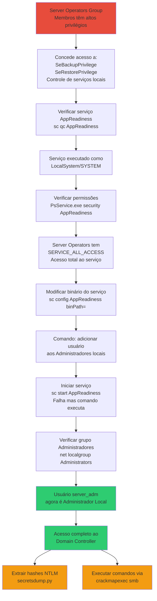

# Server Operators

```mermaid

flowchart TD
    A[Server Operators Group<br>Membros têm altos privilégios] --> B[Concede acesso a:<br>SeBackupPrivilege<br>SeRestorePrivilege<br>Controle de serviços locais]
    
    B --> C[Verificar serviço AppReadiness<br>sc qc AppReadiness]
    C --> D[Serviço executado como<br>LocalSystem/SYSTEM]
    
    D --> E[Verificar permissões<br>PsService.exe security AppReadiness]
    E --> F[Server Operators tem<br>SERVICE_ALL_ACCESS<br>Acesso total ao serviço]
    
    F --> G[Modificar binário do serviço<br>sc config AppReadiness binPath=]
    G --> H[Comando: adicionar usuário<br>aos Administradores locais]
    
    H --> I[Iniciar serviço<br>sc start AppReadiness<br>Falha mas comando executa]
    I --> J[Verificar grupo Administradores<br>net localgroup Administrators]
    
    J --> K[Usuário server_adm<br>agora é Administrador Local]
    K --> L[Acesso completo ao<br>Domain Controller]
    
    L --> M[Extrair hashes NTLM<br>secretsdump.py]
    L --> N[Executar comandos via<br>crackmapexec smb]
    
    style A fill:#e74c3c
    style K fill:#2ecc71
    style L fill:#2ecc71
    style M fill:#f39c12
    style N fill:#f39c12
```
