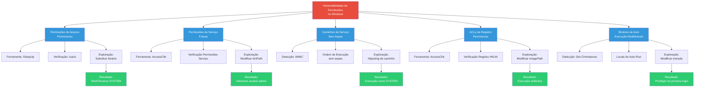

# Weak Permissions

```mermaid
flowchart TD
    A[Vulnerabilidades de Permissões<br>no Windows] --> B[Permissões de Arquivo<br>Permissivas]
    A --> C[Permissões de Serviço<br>Fracas]
    A --> D[Caminhos de Serviço<br>Sem Aspas]
    A --> E[ACLs de Registro<br>Permissivas]
    A --> F[Binários de Auto<br>Execução Modificáveis]
    
    B --> B1[Ferramenta: SharpUp]
    B --> B2[Verificação: icacls]
    B --> B3[Exploração:<br>Substituir binário]
    B3 --> B4[Resultado:<br>Shell Reverso SYSTEM]
    
    C --> C1[Ferramenta: AccessChk]
    C --> C2[Verificação Permissões Serviço]
    C --> C3[Exploração:<br>Modificar binPath]
    C3 --> C4[Resultado:<br>Adicionar usuário admin]
    
    D --> D1[Detecção: WMIC]
    D --> D2[Ordem de Execução<br>sem aspas]
    D --> D3[Exploração:<br>Hijacking de caminho]
    D3 --> D4[Resultado:<br>Execução como SYSTEM]
    
    E --> E1[Ferramenta: AccessChk]
    E --> E2[Verificação Registry HKLM]
    E --> E3[Exploração:<br>Modificar ImagePath]
    E3 --> E4[Resultado:<br>Execução arbitrária]
    
    F --> F1[Detecção: Get-CimInstance]
    F --> F2[Locais de Auto-Run]
    F --> F3[Exploração:<br>Modificar entrada]
    F3 --> F4[Resultado:<br>Privilégio na próxima login]
    
    style A fill:#e74c3c,color:white
    style B fill:#3498db,color:white
    style C fill:#3498db,color:white
    style D fill:#3498db,color:white
    style E fill:#3498db,color:white
    style F fill:#3498db,color:white
    style B4 fill:#2ecc71,color:white
    style C4 fill:#2ecc71,color:white
    style D4 fill:#2ecc71,color:white
    style E4 fill:#2ecc71,color:white
    style F4 fill:#2ecc71,color:white
```
