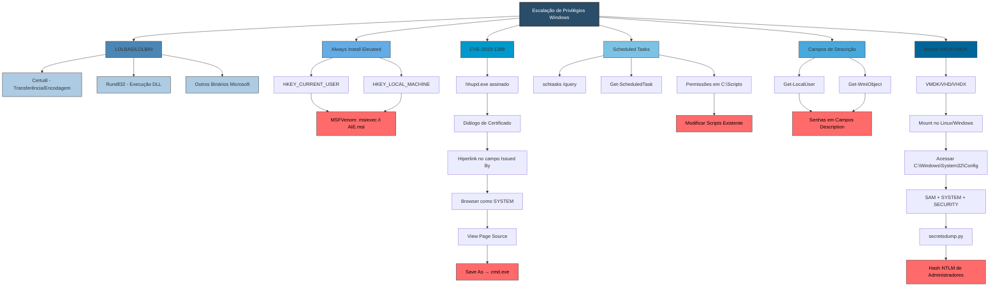

# Miscellaneous Techniques

```mermaid
graph TD
    A[Escalação de Privilégios Windows] --> B[LOLBAS/LOLBIN]
    A --> C[Always Install Elevated]
    A --> D[CVE-2019-1388]
    A --> E[Scheduled Tasks]
    A --> F[Campos de Descrição]
    A --> G[Mount VHDX/VMDK]
    
    B --> B1[Certutil - Transferência/Encodagem]
    B --> B2[Rundll32 - Execução DLL]
    B --> B3[Outros Binários Microsoft]
    
    C --> C1[HKEY_CURRENT_USER]
    C --> C2[HKEY_LOCAL_MACHINE]
    C1 --> C3[MSFVenom: msiexec /i AIE.msi]
    C2 --> C3
    
    D --> D1[hhupd.exe assinado]
    D1 --> D2[Diálogo de Certificado]
    D2 --> D3[Hiperlink no campo Issued By]
    D3 --> D4[Browser como SYSTEM]
    D4 --> D5[View Page Source]
    D5 --> D6[Save As → cmd.exe]
    
    E --> E1[schtasks /query]
    E --> E2[Get-ScheduledTask]
    E --> E3[Permissões em C:\Scripts]
    E3 --> E4[Modificar Scripts Existente]
    
    F --> F1[Get-LocalUser]
    F --> F2[Get-WmiObject]
    F1 & F2 --> F3[Senhas em Campos Description]
    
    G --> G1[VMDK/VHD/VHDX]
    G1 --> G2[Mount no Linux/Windows]
    G2 --> G3[Acessar C:\Windows\System32\Config]
    G3 --> G4[SAM + SYSTEM + SECURITY]
    G4 --> G5[secretsdump.py]
    G5 --> G6[Hash NTLM de Administradores]
    
    %% Estilos
    style A fill:#2a4d69,stroke:#333,stroke-width:2px,color:#fff
    style B fill:#4b86b4,stroke:#333
    style C fill:#63ace5,stroke:#333
    style D fill:#0099cc,stroke:#333
    style E fill:#7cc2e5,stroke:#333
    style F fill:#48a9dc,stroke:#333
    style G fill:#006699,stroke:#333
    
    style B1 fill:#adcbe3,stroke:#333
    style B2 fill:#adcbe3,stroke:#333
    style B3 fill:#adcbe3,stroke:#333
    
    style C3 fill:#ff6b6b,stroke:#333,color:#000
    style D6 fill:#ff6b6b,stroke:#333,color:#000
    style E4 fill:#ff6b6b,stroke:#333,color:#000
    style F3 fill:#ff6b6b,stroke:#333,color:#000
    style G6 fill:#ff6b6b,stroke:#333,color:#000
```
