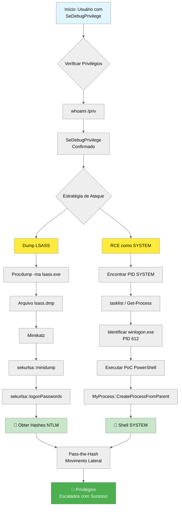

# SeDebugPrivilige

```mermaid
---
config:
  theme: neutral
---
flowchart TD
    A[Início: Usuário com<br>SeDebugPrivilege] --> B{Verificar Privilégios}
    B --> C[whoami /priv]
    C --> D[SeDebugPrivilege<br>Confirmado]
    D --> E{Estratégia de Ataque}
    E --> F[Dump LSASS]
    E --> G[RCE como SYSTEM]
    F --> H[Procdump -ma lsass.exe]
    H --> I[Arquivo lsass.dmp]
    I --> J[Mimikatz]
    J --> K[sekurlsa::minidump]
    K --> L[sekurlsa::logonPasswords]
    L --> M[🔑 Obter Hashes NTLM]
    G --> N[Encontrar PID SYSTEM]
    N --> O[tasklist / Get-Process]
    O --> P[Identificar winlogon.exe<br>PID 612]
    P --> Q[Executar PoC PowerShell]
    Q --> R[MyProcess::CreateProcessFromParent]
    R --> S[🎯 Shell SYSTEM]
    M --> T[Pass-the-Hash<br>Movimento Lateral]
    S --> T
    T --> U[🏁 Privilégios<br>Escalados com Sucesso]
    style A fill:#e1f5fe
    style M fill:#c8e6c9
    style S fill:#c8e6c9
    style U fill:#4caf50,color:white
    style F fill:#ffeb3b
    style G fill:#ffeb3b
```
