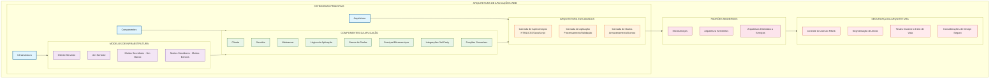

# Web Application Layout

```mermaid
graph TB
    %% Título principal
    subgraph "ARQUITETURA DE APLICAÇÕES WEB"
    
    %% Categorias principais
    subgraph CAT1["CATEGORIAS PRINCIPAIS"]
        A[Infraestrutura] --> D[Modelos de Infraestrutura]
        B[Componentes] --> E[Elementos da Aplicação]
        C[Arquitetura] --> F[Camadas e Padrões]
    end
    
    %% Modelos de Infraestrutura
    subgraph D["MODELOS DE INFRAESTRUTURA"]
        D1[Cliente-Servidor]
        D2[Um Servidor]
        D3[Muitos Servidores - Um Banco]
        D4[Muitos Servidores - Muitos Bancos]
    end
    
    %% Componentes
    subgraph E["COMPONENTES DA APLICAÇÃO"]
        E1[Cliente]
        E2[Servidor]
        E3[Webserver]
        E4[Lógica da Aplicação]
        E5[Banco de Dados]
        E6[Serviços/Microserviços]
        E7[Integrações 3rd Party]
        E8[Funções Serverless]
    end
    
    %% Arquitetura
    subgraph F["ARQUITETURA EM CAMADAS"]
        F1[Camada de Apresentação<br/>HTML/CSS/JavaScript]
        F2[Camada de Aplicação<br/>Processamento/Validação]
        F3[Camada de Dados<br/>Armazenamento/Acesso]
    end
    
    %% Padrões modernos
    subgraph G["PADRÕES MODERNOS"]
        G1[Microserviços]
        G2[Arquitetura Serverless]
        G3[Arquitetura Orientada a Serviços]
    end
    
    %% Segurança
    subgraph H["SEGURANÇA DA ARQUITETURA"]
        H1[Controle de Acesso RBAC]
        H2[Segmentação de Ativos]
        H3[Testes Durante o Ciclo de Vida]
        H4[Considerações de Design Seguro]
    end
    
    end
    
    %% Conexões entre seções
    D --> E
    E --> F
    F --> G
    G --> H
    
    %% Estilo
    classDef category fill:#e1f5fe,stroke:#01579b,stroke-width:2px
    classDef model fill:#f3e5f5,stroke:#4a148c,stroke-width:1px
    classDef component fill:#e8f5e8,stroke:#1b5e20,stroke-width:1px
    classDef architecture fill:#fff3e0,stroke:#e65100,stroke-width:1px
    classDef modern fill:#fce4ec,stroke:#880e4f,stroke-width:1px
    classDef security fill:#ffebee,stroke:#b71c1c,stroke-width:1px
    
    class A,B,C category
    class D1,D2,D3,D4 model
    class E1,E2,E3,E4,E5,E6,E7,E8 component
    class F1,F2,F3 architecture
    class G1,G2,G3 modern
    class H1,H2,H3,H4 security
```
