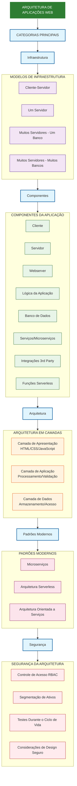

# Web Application Layout

```mermaid
graph TB
    %% Título principal
    A[ARQUITETURA DE APLICAÇÕES WEB]
    
    %% Categorias principais
    B[CATEGORIAS PRINCIPAIS]
    
    %% Infraestrutura
    C[Infraestrutura]
    subgraph D["MODELOS DE INFRAESTRUTURA"]
        D1[Cliente-Servidor]
        D2[Um Servidor]
        D3[Muitos Servidores - Um Banco]
        D4[Muitos Servidores - Muitos Bancos]
    end
    
    %% Componentes
    E[Componentes]
    subgraph F["COMPONENTES DA APLICAÇÃO"]
        F1[Cliente]
        F2[Servidor]
        F3[Webserver]
        F4[Lógica da Aplicação]
        F5[Banco de Dados]
        F6[Serviços/Microserviços]
        F7[Integrações 3rd Party]
        F8[Funções Serverless]
    end
    
    %% Arquitetura
    G[Arquitetura]
    subgraph H["ARQUITETURA EM CAMADAS"]
        H1[Camada de Apresentação<br/>HTML/CSS/JavaScript]
        H2[Camada de Aplicação<br/>Processamento/Validação]
        H3[Camada de Dados<br/>Armazenamento/Acesso]
    end
    
    %% Padrões modernos
    I[Padrões Modernos]
    subgraph J["PADRÕES MODERNOS"]
        J1[Microserviços]
        J2[Arquitetura Serverless]
        J3[Arquitetura Orientada a Serviços]
    end
    
    %% Segurança
    K[Segurança]
    subgraph L["SEGURANÇA DA ARQUITETURA"]
        L1[Controle de Acesso RBAC]
        L2[Segmentação de Ativos]
        L3[Testes Durante o Ciclo de Vida]
        L4[Considerações de Design Seguro]
    end
    
    %% Conexões verticais
    A --> B
    B --> C
    C --> D
    D --> E
    E --> F
    F --> G
    G --> H
    H --> I
    I --> J
    J --> K
    K --> L
    
    %% Estilo
    classDef title fill:#2e7d32,stroke:#fff,color:#fff,stroke-width:2px
    classDef category fill:#e1f5fe,stroke:#01579b,stroke-width:2px
    classDef model fill:#f3e5f5,stroke:#4a148c,stroke-width:1px
    classDef component fill:#e8f5e8,stroke:#1b5e20,stroke-width:1px
    classDef architecture fill:#fff3e0,stroke:#e65100,stroke-width:1px
    classDef modern fill:#fce4ec,stroke:#880e4f,stroke-width:1px
    classDef security fill:#ffebee,stroke:#b71c1c,stroke-width:1px
    
    class A title
    class B,C,E,G,I,K category
    class D1,D2,D3,D4 model
    class F1,F2,F3,F4,F5,F6,F7,F8 component
    class H1,H2,H3 architecture
    class J1,J2,J3 modern
    class L1,L2,L3,L4 security
```
